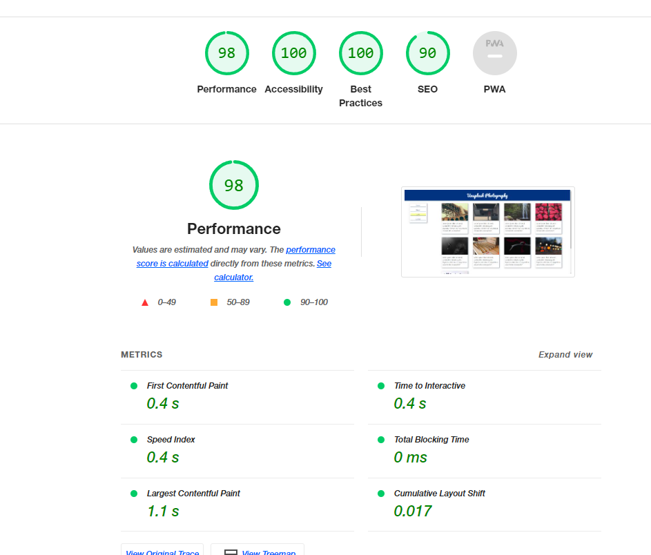

# m12-hw-12-christensen-kristine
Assignment 12: Use CSS Grid to Create a Webpage Layout

## About This Assignment ##
1.	Make the body tag a CSS Grid container and apply column and row rules.
2.	Make the .img_card__container a grid container that auto-fills columns of image cards.
3.	Ensure the site is responsive on desktop, tablet, and mobile screens.
4.	Make your site as close to the provided mockups as possible.

## Lighthouse Report ##
